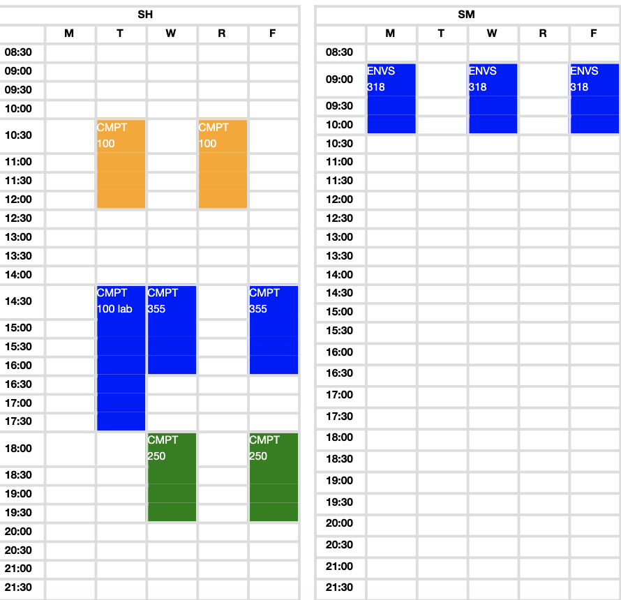
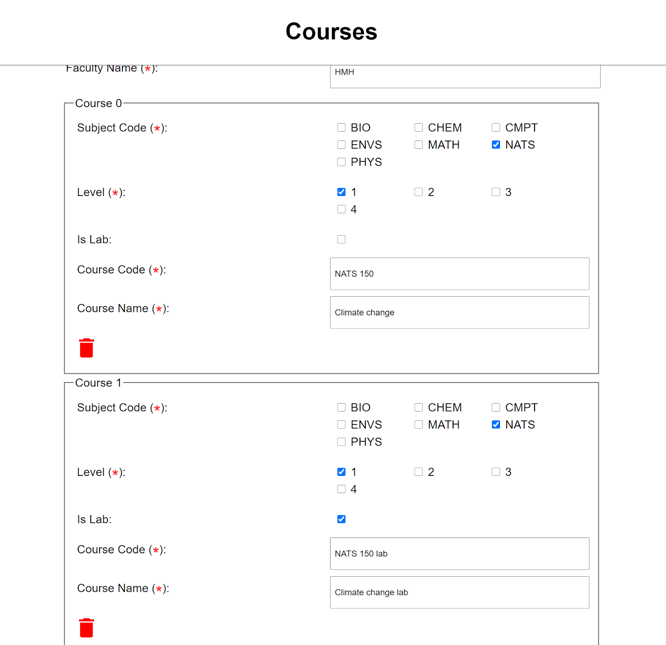
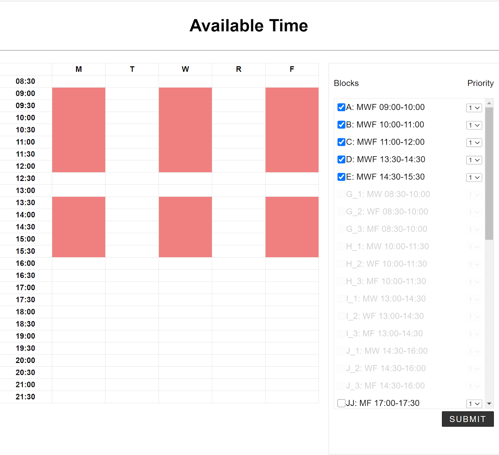
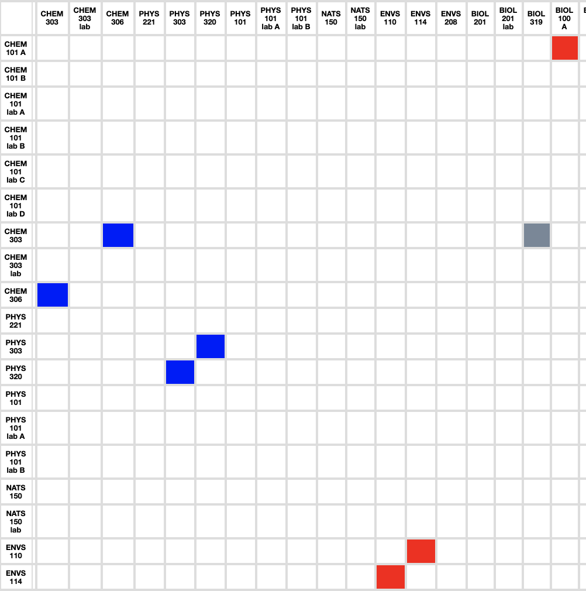
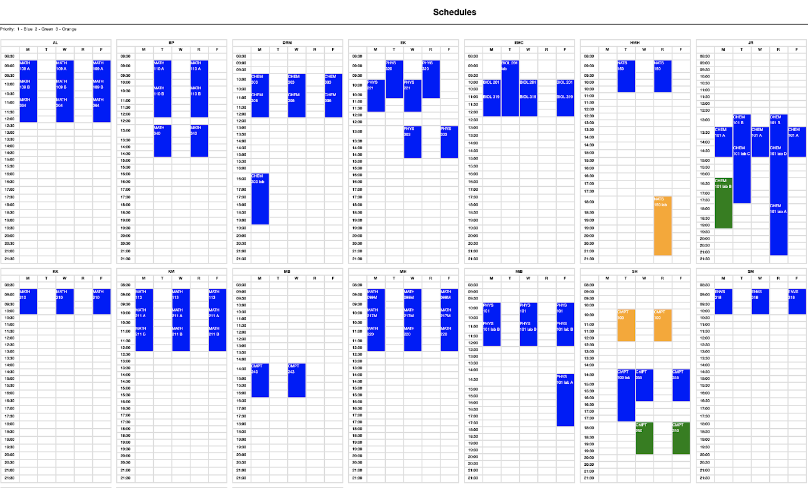
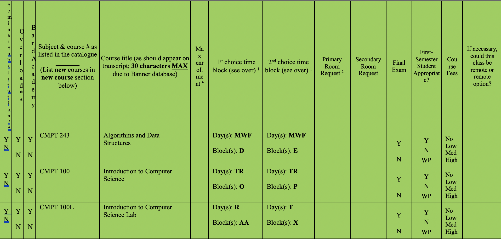
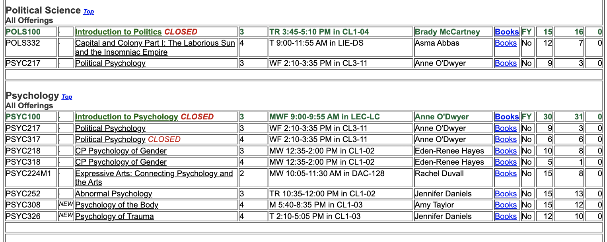

# Faculty Course Schedule Optimization Application

## Summary

    This application serves as an optimization tool for Simon's Rock College professors to build a high quality  course schedule with maximum satisfaction. Professors need to reconcile different time preferences and overlapping constraints, which are hard to accomplish manually. This application uses a method of stochastic optimization called Genetic Algorithm to solve this problem.

## Some Screenshots

Professors can enter numerous number of courses that they want to teach
 

Professors can choose multiple time blocks without worrying about time overlaps 
 

The department head can choose which courses are restricted to be overlapped.

Red squares indicate that those two courses (in that row and column) must not overlap. Blue squares tell that it is not preferable for those two courses to be overlapped but it can still overlap if it has to. Grey square shows the current selection.

 

An example of high quality schedule that the software produces

## Why build it?

    For each semester, Simon's Rock College professors are assigned to teach a certain number of courses. They select the time blocks for each course that they are planning to teach and submit them using a physical green sheet.

Example of Green Sheet

    This green sheet allows professors to select a maximum of two alternative time blocks per course. Before submitting the green sheets, professors discuss their time blocks at the division meeting. The blocks are then submitted to the division head for approval and later transfer to the Registrar.

    The registrar then enters these courses manually into the system to create a course guide. After the course guide has been released, students select the courses that they want to take and register for those courses on the registration day.

    Example of course guide

    This entire process is quite inefficient and can be done better by using software. This optimization software helps to eliminate the time for having division meetings and helps to remove overlapping constraints.

## Functionality

    Professors can add various numbers of courses and choose multiple time blocks. The application ensures that no overlapping time blocks can be selected.

    The division head can then mark whether the two courses can overlap with each other to answer this question: "Will there be a student who would need to take both Course X and Course Y?". Some courses are offered in a particular semester so if the students cannot take both required classes, this can result in delaying their graduation.

    After the inputs from the professors and the division head, the software will automatically create a high quality schedule.

## Tech Stack
<ul>
    <li>HTML</li>
    <li>CSS</li>
    <li>JS</li>
    <li>PHP (for saving the form inputs)</li>
    <li>Python (for creating optimized schedule)</li>
</ul>

